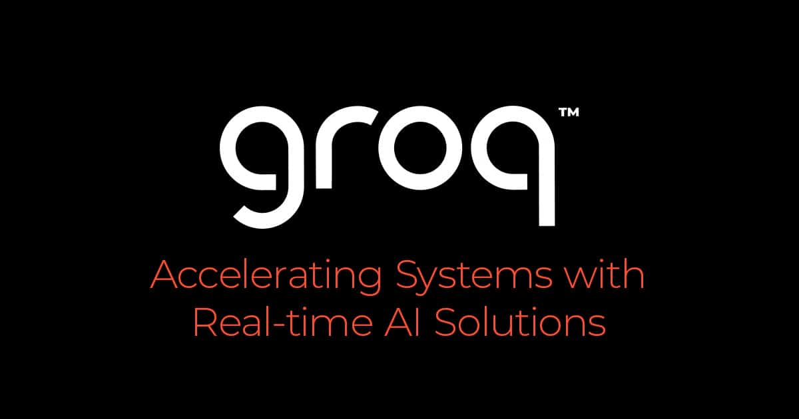
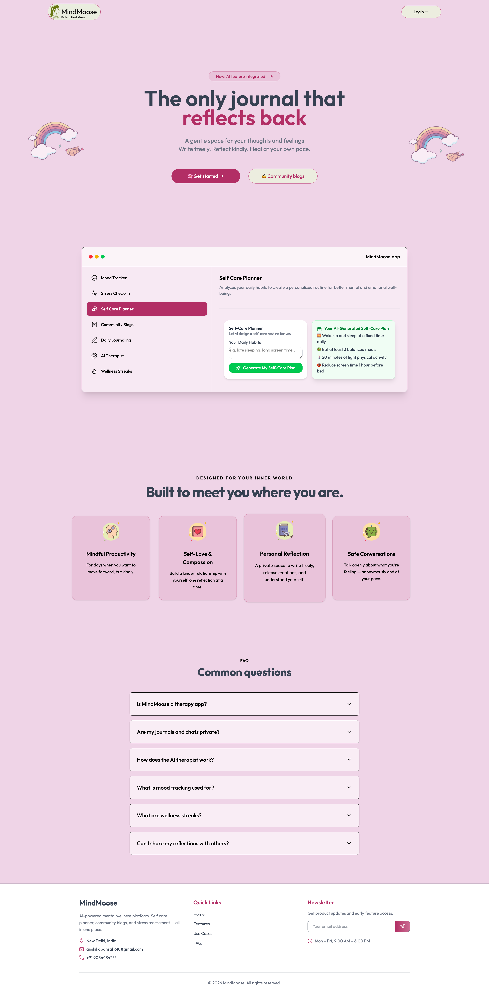
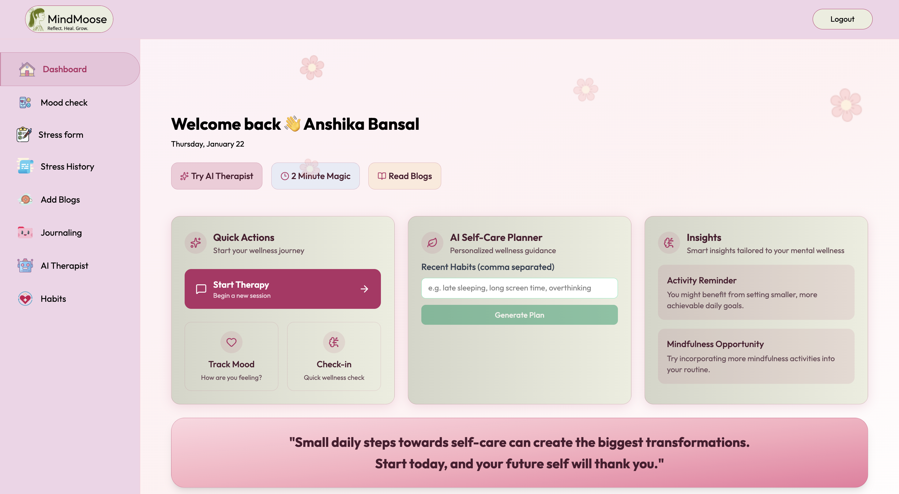
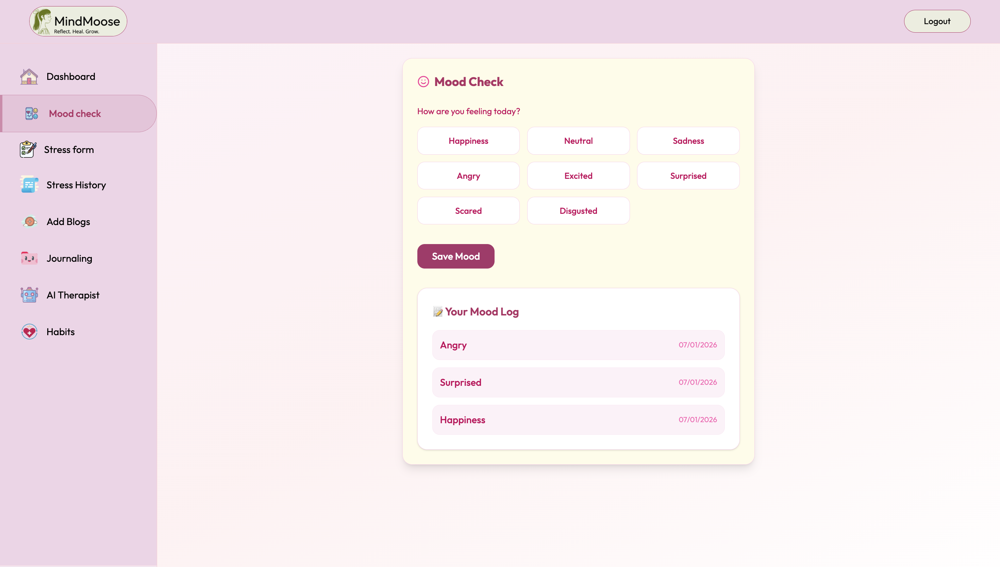
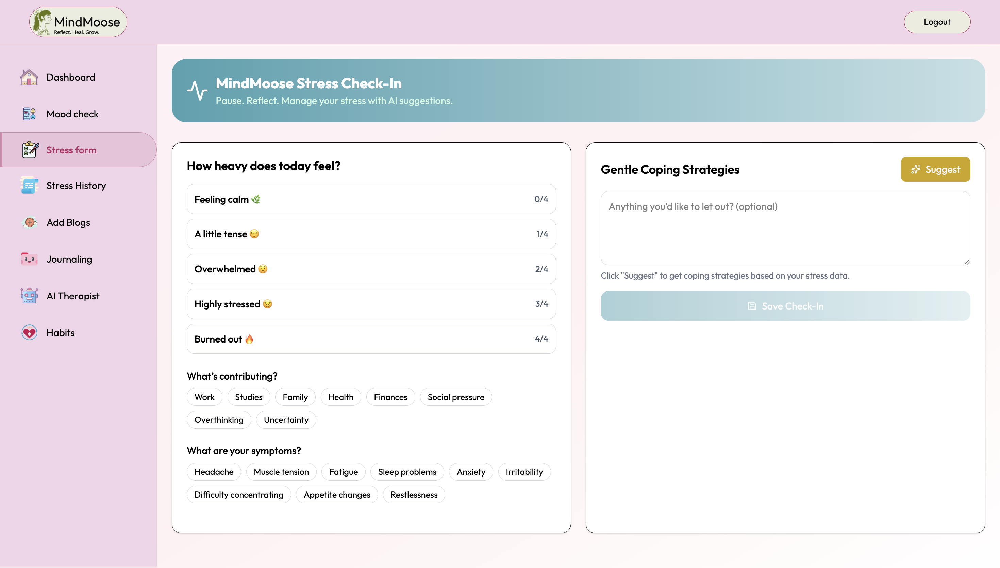
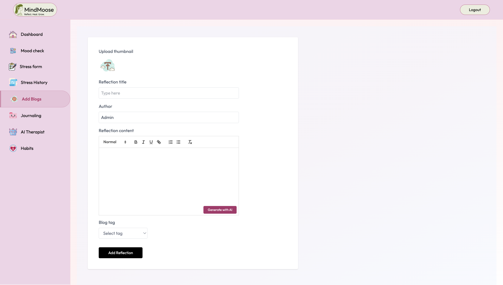
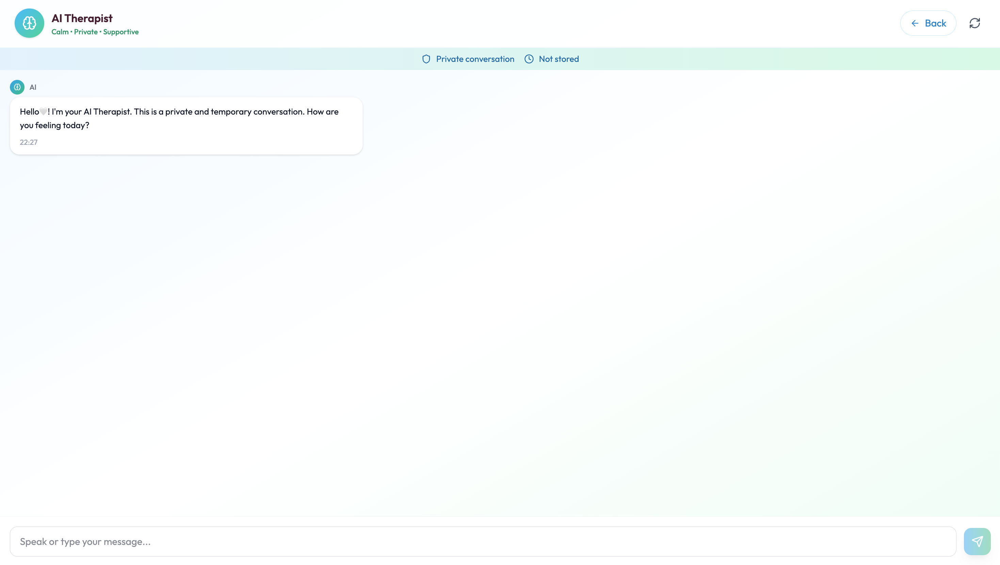
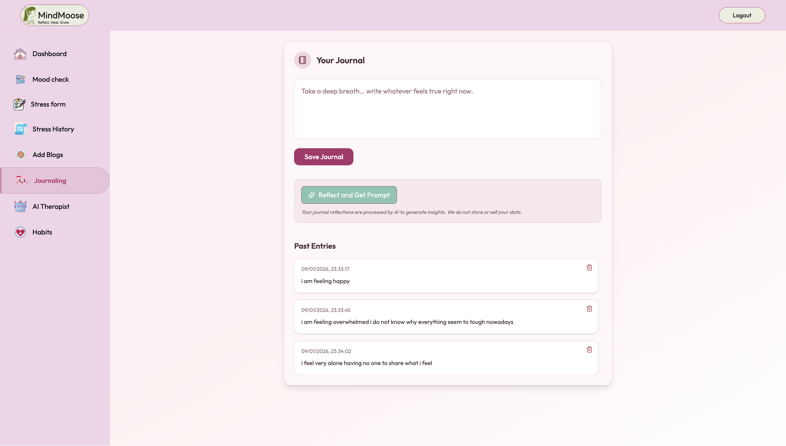
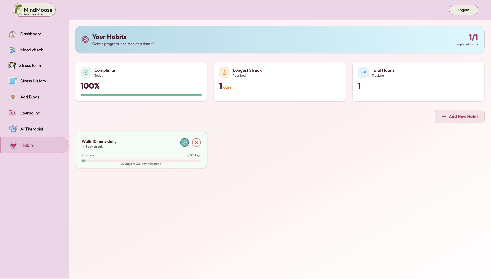
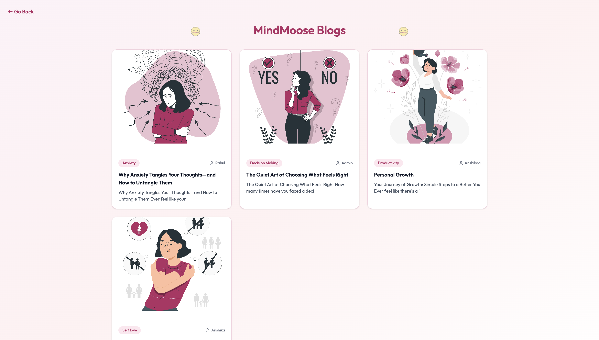

<p align="center">
  
</p>


> AI-powered mental wellness platform that adapts to your emotional needs. Reflect, heal, and grow effortlessly.

## 📌 Overview

MindMoose is an AI-powered mental wellness platform designed to help individuals understand, nurture, and strengthen their mental well-being. The platform combines reflective tools, intelligent insights, and supportive AI guidance to create a safe space that grows with your emotional journey.

### 🌿 Key Features

- **Mood Tracking**: Log and monitor daily emotions to identify patterns and triggers over time  
- **Stress Assessments**: Take guided assessments and view your stress levels with clear insights  
- **AI Coping Strategies**: Get personalized AI-generated techniques to manage stress, anxiety, and overthinking  
- **Journaling Space**: Write and reflect at your own pace in a private, judgment-free environment  
- **AI Therapist**: Talk freely with an AI-powered mental health companion whenever you need support  
- **AI Self-Care Plans**: Receive personalized plans to overcome habits like irregular sleep, overthinking, and burnout  
- **Habit Streaks**: Build healthy routines and foster productivity through consistency tracking  
- **2-Minute Breathing Exercises**: Quick guided breathing sessions to relax and reset your mind  
- **Community Blogs**: Publish and explore blogs to strengthen community connection and engagement  

## Integrating Groq for Advanced AI Capabilities  

Groq is revolutionizing AI inference by providing ultra-fast, energy-efficient solutions tailored for deploying and running AI models. Founded in 2016, Groq anticipated the industry's shift towards AI inference and has developed the Groq Language Processing Unit (LPU) to meet these demands. Unlike traditional GPUs designed for graphics processing, the LPU is purpose-built for AI tasks, delivering unparalleled speed and efficiency.  


## Leveraging Groq in Our Project  

<p align="center">
  
</p>


In our project, Groq's technology is seamlessly integrated across multiple features to enhance performance and user experience:  


### 🚀 AI-Powered Chatbot  
Utilizing Groq's API, our chatbot offers real-time, accurate and thoughtful responses, effectively addressing user queries and providing instant assistance.  

## 🖼️ Snippets 


*Landing page of MindMoose*


*Dashboard of MindMoose*

## ✨ Preview

<div style="display: flex; justify-content: space-between;">
  
  
</div>

<div style="display: flex; justify-content: space-between;">
  
  
</div>

<div style="display: flex; justify-content: space-between;">
  
  
</div>

<div style="display: flex; justify-content: space-between;">
  
</div>

## 🛠️ Tech Stack

### Frontend
|  |  |  |
|---|---|---|

### Backend
|  |  |  |
|---|---|---|

### API Used
|  |  |
|---|---|

## 🚀 Getting Started

## Technical Implementation Details for Groq

To integrate Groq's API into our project, follow these steps:  

### 1️⃣ Obtain a Groq API Key  
Sign up on the [Groq Developer Console](https://groq.com/) to receive your API key.  

### 2️⃣ Set Up Environment Variables  
In your `.env` file, include the following variables:  

```env
VITE_GROQ_API_KEY=your_groq_api_key
```
### 3️⃣ In your project directory, install the official Groq client:

```env
npm i groq-sdk
```

## Feedback

If you have any feedback, please reach out to me at anshikabansal1618@gmail.com
